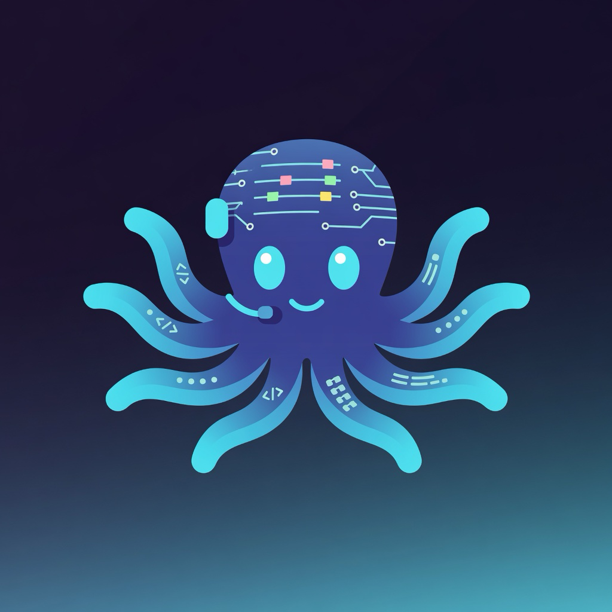

<p align="center">
  
</p>

<h1 align="center">Crewtopus</h1>

<p align="center">
  <strong>Many AI arms. One sprint crew.</strong><br/>
  Local multi-agent orchestration — staff BA, PM, and developers (Grok, Copilot, Claude, Ollama, and more) on a Kanban board with full lifecycle automation.
</p>

<p align="center">
  <a href="./LICENSE"></a>
  <a href="https://nodejs.org/"></a>
  <a href="https://github.com/calvin11527/crewtopus/releases"></a>
</p>

<p align="center">
  
</p>

<p align="center"><em>Dashboard → agents → sprint board → work-item console (short walkthrough)</em></p>

> **Security notice:** Crewtopus runs coding agents with broad local tool/filesystem access. Use only on machines and repositories you trust. Do **not** expose the API to the public internet without authentication. See [SECURITY.md](./SECURITY.md).

## Why Crewtopus?

Coding agents are powerful alone. **Crewtopus** turns them into a **sprint crew**:

- **Board-first** — epics, stories, tasks with live agent activity  
- **Full lifecycle** — Business Analyst → Project Manager (auto-create tasks) → developer pipeline  
- **Switch adapters** — e.g. Copilot → Grok when a provider is over quota (same staffed role)  
- **Privacy guard** — best-effort secret scanning before outbound context  
- **Local-first** — optional Ollama; Docker infra for Redis / Ollama / metrics  

*Many tentacles, one delivery.*

## Prerequisites

- **Node.js ≥ 20**
- **npm** (workspaces)
- **Docker Desktop** (optional but recommended for Redis / Ollama / metrics)
- At least one agent CLI: Grok, Copilot, Claude Code, Ollama, etc.

## Quick start

```bash
git clone https://github.com/calvin11527/crewtopus.git
cd crewtopus

# Optional infrastructure (Redis, Ollama, Prometheus, Grafana)
cd src
npm run infra:up

# Install
npm install
cd backend && npm install
cd ../frontend && npm install
cd ..

# Optional config
cp ../.env.example .env

# Run API + UI
npm run dev
```

| Service | URL |
|---------|-----|
| Frontend | http://localhost:5173 |
| Backend API | http://localhost:3000 |
| Grafana (if infra up) | http://localhost:3001 |

Open **http://localhost:5173** → **Workspaces** → **Agents** → **Board** → staff a sprint team → run **Full lifecycle** on a story.

### First five minutes

1. **Configure agents** — Agent Registry → set adapter (Grok, Copilot, Ollama, …) and model. Over quota? Switch adapter type.
2. **Create a workspace** and link a local project folder.
3. **Create a sprint** and staff BA, PM, and developer roles.
4. **Add a story** and run **Full lifecycle**.
5. Watch **Live Activity** / work-item console for CLI output.

## Configuration

See **[.env.example](./.env.example)** for environment variables.

| Variable | Purpose |
|----------|---------|
| `PORT` | Backend HTTP port (default `3000`) |
| `AGENTHUB_WORK_DIR` | Root for agent work artifacts *(legacy env prefix; still used)* |
| `AGENTHUB_DB_PATH` | SQLite path |
| `OLLAMA_HOST` | Local Ollama URL |
| `GROK_*` / `COPILOT_*` | Adapter CLI paths, timeouts, permissions |

## Project layout

```
crewtopus/
├── README.md
├── LICENSE                 # PolyForm Noncommercial 1.0.0
├── SECURITY.md
├── .env.example
├── docs/
│   └── assets/            # Logo & brand
└── src/
    ├── backend/           # Express + WebSocket + SQLite
    ├── frontend/          # React + Vite UI
    ├── infra/             # Docker Compose / k8s
    └── package.json
```

More detail: [src/README.md](./src/README.md) · [src/infra/README.md](./src/infra/README.md)

## Development

```bash
cd src
npm run dev
npm test
npm run build
```

## Architecture

```
Frontend (React)  ──REST/WS──▶  Backend (Express)
                                    ├── Agent adapters (CLI)
                                    ├── Lifecycle (BA / PM / pipeline)
                                    ├── Privacy guard + audit
                                    └── SQLite + optional Redis
```

## Documentation / Wiki

- **[GitHub Wiki](https://github.com/calvin11527/crewtopus/wiki)** — Getting Started, Architecture, Agents, Lifecycle, Config, Security, Troubleshooting
- Source of truth for wiki pages: [`docs/wiki/`](./docs/wiki/)
- Repo docs: [src/README.md](./src/README.md) · [SECURITY.md](./SECURITY.md)

## Contributing

Issues and PRs welcome. Please:

1. Open an issue for large changes.
2. Keep PRs focused; add tests when behavior changes.
3. Never commit secrets or personal machine paths.
4. Run `npm test` under `src/` before submitting.

## License

[PolyForm Noncommercial License 1.0.0](./LICENSE) © Crewtopus Contributors

**Non-commercial use only.** You may use, study, and modify Crewtopus for personal,
educational, research, hobby, and other non-commercial purposes. **Commercial use
is not allowed** under this license (for example selling the software, using it to
provide paid services, or internal business use that is commercial in nature).

For commercial licensing, contact the maintainers.

> **Note:** Code published under MIT before this change remains available under MIT
> for those earlier commits only. This and future releases use PolyForm Noncommercial.
