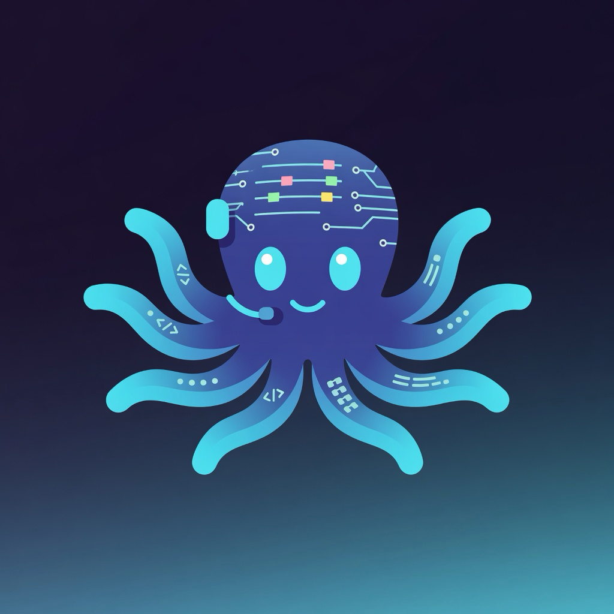

<p align="center">
  
</p>

<h1 align="center">Crewtopus</h1>

<p align="center">
  <strong>Many AI arms. One sprint crew.</strong><br/>
  Local multi-agent orchestration — staff BA, PM, and developers on a Kanban board<br/>
  and run a full delivery lifecycle (not just another chat window).
</p>

<p align="center">
  <a href="./LICENSE"></a>
  <a href="https://nodejs.org/"></a>
  <a href="https://github.com/calvin11527/crewtopus/releases"></a>
  <a href="https://github.com/calvin11527/crewtopus/issues"></a>
</p>

<p align="center">
  
</p>

<p align="center"><em>Dashboard → agents → sprint board → work-item console</em></p>

> **Security:** Agents get broad local filesystem/tool access. Use only on machines and repos you trust. Do **not** expose the API to the public internet without auth. See [SECURITY.md](./SECURITY.md).

---

## Problem

Coding agents are strong **alone**. Delivery still falls apart because:

- Work lives in **chat history**, not on a board  
- There is no **BA → PM → dev → review** handoff  
- When one provider is over quota, you restart the whole thread  

**Crewtopus** turns agents into a **sprint crew**: roles, board state, pipeline, audit, adapter switch.

> One agent is a tool. A crew is a process.

---

## Try it (no API keys)

### Option A — one command (Docker)

**Requirements:** Docker Desktop running.

```bash
git clone https://github.com/calvin11527/crewtopus.git
cd crewtopus
./demo.sh
```

That builds the lean stack (API + UI only), waits for health, runs a **mock** implement → test → review pipeline, and prints links.

| Service | URL |
|---------|-----|
| UI | http://localhost:8080 |
| Board | http://localhost:8080/board |
| API (via nginx) | http://localhost:8080/api |

```bash
./demo.sh run    # re-run mock pipeline
./demo.sh logs   # follow logs
./demo.sh down   # stop
```

### Option B — local one-shot (`./quickstart.sh`)

**Requirements:** Node.js ≥ 20, npm.

```bash
git clone https://github.com/calvin11527/crewtopus.git
cd crewtopus
./quickstart.sh        # install + dev + open browser + mock demo
```

**Daily start on macOS** — double-click **`Crewtopus.app`** in Finder (logo icon).  
That opens Terminal, starts API + UI, and opens the browser when ready.

```bash
./start.sh             # same thing from a terminal (backend :3000 + frontend :5173)
```

Or step-by-step:

```bash
cd crewtopus/src
npm run setup && npm run dev
# second terminal:
npm run demo
```

Keyboard: **⌘K / Ctrl+K** command palette · SuperGrok helper: `/supergrok-sync.html`

| Service | URL |
|---------|-----|
| UI | http://localhost:5173 |
| API | http://localhost:3000 |

### In the UI (same mock path)

1. Open **Scrum Board**  
2. Click **Multi-agent demo** (mock pipeline → **done / approved**)  
3. Open the card → **Agent console** + history  

No Grok, Copilot, Claude, or Ollama required — built-in **Mock Agent**.  

---

## Who it's for

| You want… | Crewtopus |
|-----------|-----------|
| Process around agents you already use (Grok / Copilot / Claude / Ollama) | Yes |
| Local-first board + lifecycle on *your* machine | Yes |
| Fully unattended production deploys | Not yet — human review still matters |
| Multi-tenant cloud SaaS | No (local orchestration) |

---

## Crewtopus vs “just chat”

| | Chat / single agent | Crewtopus |
|--|---------------------|-----------|
| Work tracking | Transcript | Kanban epics / stories / tasks |
| Roles | One prompt | BA, PM, developer, tester, reviewer |
| Failures | Restart chat | Retry, audit, board status |
| Quota | Stuck | Switch adapter, same staffed role |
| Privacy | Hope | Best-effort secret scan before outbound context |

---

## Real agents (after the mock demo)

1. **Agents** — set adapter (Grok, Copilot, Claude, Ollama, …) and model. Over quota? Change adapter type on the same role.  
2. **Workspaces** — link a local project folder.  
3. **Board** — create a sprint, staff BA / PM / developers.  
4. Add a **story** → **Full lifecycle** (BA → PM tasks → developer pipeline).  
5. Watch **Live Activity** / work-item console.

Optional infra (Redis, Ollama, Prometheus, Grafana):

```bash
cd src
npm run infra:up
```

---

## Configuration

See **[.env.example](./.env.example)**.

| Variable | Purpose |
|----------|---------|
| `PORT` | Backend HTTP port (default `3000`) |
| `AGENTHUB_WORK_DIR` | Agent work artifacts *(legacy prefix; still used)* |
| `AGENTHUB_DB_PATH` | SQLite path |
| `OLLAMA_HOST` | Local Ollama URL |
| `GROK_*` / `COPILOT_*` | Adapter CLI paths, timeouts, permissions |

---

## Project layout

```
crewtopus/
├── README.md
├── LICENSE                 # MIT
├── CONTRIBUTING.md
├── SECURITY.md
├── docs/
│   ├── ROADMAP.md
│   ├── assets/             # Logo & demo GIF
│   └── wiki/               # Wiki source
└── src/
    ├── backend/            # Express + WebSocket + SQLite
    ├── frontend/           # React + Vite UI
    ├── infra/              # Docker Compose / k8s
    ├── scripts/            # demo + automation proofs
    └── package.json
```

---

## Architecture

```
Frontend (React)  ──REST/WS──▶  Backend (Express)
                                    ├── Agent adapters (CLI + mock)
                                    ├── Lifecycle (BA / PM / pipeline)
                                    ├── Privacy guard + audit
                                    └── SQLite + optional Redis
```

---

## Usage metering (what “realtime” means)

Providers rarely expose live billing APIs for CLI subscriptions. Crewtopus uses a **hybrid**:

1. **Immediate** — every agent run updates audit tokens and broadcasts `usage:update` over WebSocket  
2. **Local CLI sessions** — Copilot `~/.copilot` shutdown events; Grok session files are diagnostic only (context peaks ≠ monthly bill)  
3. **SuperGrok (Grok)** — **weekly** shared limit (Build + Conversation). Use the [bookmarklet](./docs/supergrok-bookmarklet.md) or paste panel text into **Sync SuperGrok** on Credit Usage / Agents. That % is the source of truth until you sync again.  
4. **Throttle signals** — rate-limit / quota errors surface live even when % looks fine  

**Sync now** rescans local CLI session files. **Sync SuperGrok** (bookmarklet or paste) is what makes Grok match the website — helper UI also at `/supergrok-sync.html`.

### Self-improving agents

Crewtopus **learns** adapter features (`--help` probes, run outcomes, errors) and opens **opt-in suggestions** (e.g. switch adapter when over quota). See Agents → **Self-improving agents**.

## Known limitations (honest)

- Best on **trusted local repos**; not a hardened multi-tenant server.  
- Real CLI adapters need those tools installed and authenticated.  
- Credit % is best-effort — not a 1:1 mirror of provider billing UIs.  
- “Crew = process” is a **harness** — quality still depends on models, prompts, and human review.  
- Pre-1.0 (`v0.x`) — APIs and UX may change.

See [docs/ROADMAP.md](./docs/ROADMAP.md).

---

## Documentation

- [CONTRIBUTING.md](./CONTRIBUTING.md) — setup, tests, PR tips  
- [docs/COMPARISON.md](./docs/COMPARISON.md) — vs Cursor / Claude Code chat  
- [docs/CASE_STUDY.md](./docs/CASE_STUDY.md) — share a real sprint  
- [docs/ARCHITECTURE.md](./docs/ARCHITECTURE.md) — module map  
- [docs/supergrok-bookmarklet.md](./docs/supergrok-bookmarklet.md) — SuperGrok weekly sync  
- [docs/ROADMAP.md](./docs/ROADMAP.md) — near-term priorities  
- [SECURITY.md](./SECURITY.md) · [CODE_OF_CONDUCT.md](./CODE_OF_CONDUCT.md)  
- [GitHub Wiki](https://github.com/calvin11527/crewtopus/wiki) · source in [`docs/wiki/`](./docs/wiki/)  
- [src/README.md](./src/README.md) · [src/infra/README.md](./src/infra/README.md)

---

## Contributing

Issues and PRs welcome. Good first issues: [`good first issue`](https://github.com/calvin11527/crewtopus/issues?q=is%3Aissue+is%3Aopen+label%3A%22good+first+issue%22).

```bash
cd src && npm test
```

---

## License

[MIT](./LICENSE) © Crewtopus Contributors

Earlier commits briefly used PolyForm Noncommercial; **current `main` is MIT**.

---

*Many tentacles, one delivery.*
