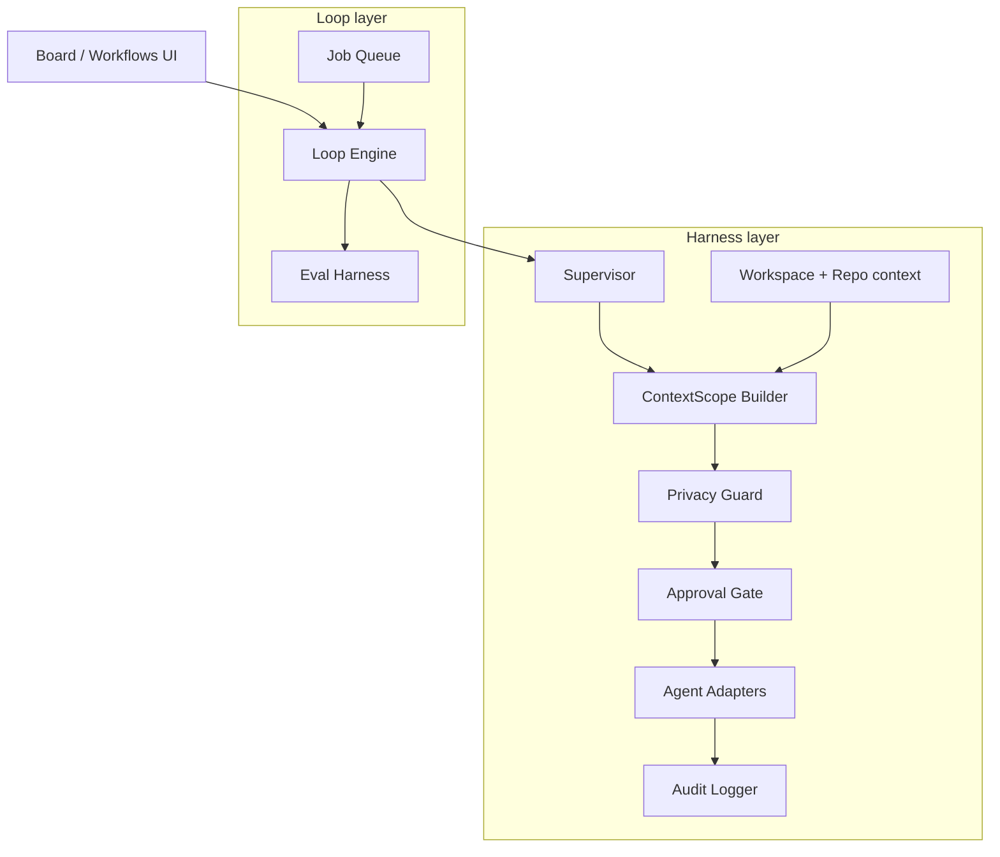

# AgentHub Loop & Harness Engineering Roadmap

**North star:** AgentHub is a platform for **harness engineering** (safe, observable scaffolding around agents) and **loop engineering** (repeatable implement → verify → fix cycles with clear termination).

**Baseline (June 2026):** ~70% harness, ~35% loops, ~55% overall toward the north star.

This document orders the remaining work into milestones. Each milestone has deliverables, touch points, and acceptance criteria. **Do not start a later milestone until the prior one's acceptance criteria pass.**

---

## Architecture target



**Design principle:** All agent I/O still flows through `executeOutboundPipeline`. Loops orchestrate *when* and *why* to call it—not a second path.

---

## Milestone 1 — Close the implement/review loop

**Goal:** Turn the Grok → Copilot pipeline from a one-shot into a **closed loop** that iterates until approved, budget exhausted, or human escalation.

**Why first:** Highest leverage; validates loop semantics on real work items before generalizing.

### Deliverables

1. **Iteration state on work items**
   - Track `loopIteration`, `maxLoopIterations` (default 3), `loopStatus` (`idle` | `running` | `approved` | `escalated` | `failed`).
   - Store in `work_item` table (new columns) or `work_item.metadata` JSON column.

2. **Closed-loop runner in `work-item-pipeline.ts`**
   - On `CHANGES_REQUESTED`: feed review feedback into the next Grok prompt and re-run implementation.
   - On `APPROVED`: set status `done`, `loopStatus` `approved`.
   - On max iterations: set status `in_review`, `loopStatus` `escalated`, log activity for human pickup.
   - On agent failure: `loopStatus` `failed`, preserve last review output for debugging.

3. **Richer fix prompt**
   - Include prior implementation output, reviewer feedback, and list of files created/modified in work dir.

4. **API**
   - `POST /work-items/:id/pipeline` accepts optional `{ maxIterations?: number, autoLoop?: boolean }`.
   - `GET /work-items/:id/loop` returns iteration history from activity log.

5. **Board UI**
   - Show iteration badge (e.g. `2/3`) on cards during loop runs.
   - Activity panel groups steps by iteration.
   - Escalated items surface a "needs human review" state.

6. **Tests**
   - Mock adapter returns `CHANGES_REQUESTED` then `APPROVED` on second review → assert 2 implement + 2 review steps.
   - Max-iteration cap → assert `escalated` and status `in_review`.

### Touch points

| Area | Files |
|------|-------|
| Schema | `src/backend/src/database.ts` |
| Types | `src/backend/src/types.ts`, `src/frontend/src/types.ts` |
| Loop logic | `src/backend/src/modules/work-item-pipeline.ts` |
| API | `src/backend/src/routes/work-items.ts` |
| UI | `src/frontend/src/pages/Board.tsx`, `src/frontend/src/api/hooks.ts` |
| Tests | `src/backend/src/__tests__/work-item-pipeline.test.ts` |

### Acceptance criteria

- [ ] Demo work item can run Grok → Copilot → Grok → Copilot and land on `done` when mock review approves on pass 2.
- [ ] Loop stops at `maxLoopIterations` with clear escalation, no infinite runs.
- [ ] Every iteration step has audit + activity entries.
- [ ] Board shows live iteration progress via WebSocket.

**Estimated effort:** 2–4 days

---

## Milestone 2 — Loop primitive in the workflow engine

**Goal:** Replace hardcoded pipeline logic with a **reusable loop construct** inside `WorkflowDefinition`, so any agent pair (or N-agent sequence) can express implement/review cycles.

### Deliverables

1. **Extend workflow types**

   ```typescript
   interface WorkflowLoop {
     id: string;
     steps: WorkflowStep[];           // e.g. [implement, review]
     until: 'verdict_approved' | 'step_output_match' | 'eval_pass';
     maxIterations: number;
     onExhausted: 'escalate' | 'fail' | 'human_approval';
     verdictParser?: 'approved_changes_requested' | 'custom_regex';
   }

   interface WorkflowDefinition {
     name: string;
     steps: WorkflowStep[];
     loops?: WorkflowLoop[];
   }
   ```

2. **`runLoop` in `workflow-engine.ts`**
   - Nested loop execution inside `runExecutionLoop`.
   - Step outputs passed forward; loop condition evaluated after each full cycle.
   - Pause/resume/cancel applies to active loop iteration.

3. **Unify work-item pipeline**
   - `runWorkItemPipeline` delegates to workflow execution using the Grok→Copilot template loop block.
   - Delete duplicate orchestration once parity is proven.

4. **Workflows UI**
   - Visual indicator for loop blocks (iteration count, condition).
   - Trigger workflow execution with loop from UI.

5. **Tests**
   - Workflow with 2-step loop, mock verdict sequence, assert iteration count in execution result metadata.

### Touch points

| Area | Files |
|------|-------|
| Types | `src/backend/src/types.ts` |
| Engine | `src/backend/src/modules/workflow-engine.ts` |
| Pipeline | `src/backend/src/modules/work-item-pipeline.ts` |
| UI | `src/frontend/src/pages/Workflows.tsx` |
| Tests | `src/backend/src/__tests__/workflow-engine.test.ts` |

### Acceptance criteria

- [ ] Work-item pipeline and manual workflow execution produce identical step sequences for the same template.
- [ ] Loop config is JSON-serialized in `workflow.definition` and survives restart.
- [ ] No second outbound path—all steps still use `executeOutboundPipeline`.

**Depends on:** M1 (verdict parsing and iteration semantics proven)

**Estimated effort:** 4–6 days

---

## Milestone 3 — Workspace-aware context in loops

**Goal:** Loops operate on **real code**, not empty `ContextScope`. Harness value is minimal, relevant context per iteration.

### Deliverables

1. **Resolve context from workspace**
   - When work item has `workspaceId`, load linked repositories from `repository` table.
   - Default file selection: changed files in work dir + optional repo globs from workspace config.

2. **Per-iteration context refresh**
   - After each implement step, rebuild `ContextScope` with new/modified files and git diffs.
   - Token budget enforced via existing `applyTokenLimit`.

3. **Sensitivity propagation**
   - Workspace privacy policies apply inside loop runs (not bypassed by work-item shortcut).

4. **Board / workspace linking**
   - Create work items tied to workspace; pipeline auto-includes repo context.

5. **Tests**
   - Context includes file written in work dir after implement step.
   - Privacy guard blocks secret injected into work dir on next iteration.

### Touch points

| Area | Files |
|------|-------|
| Context | `src/backend/src/modules/context-scope.ts` |
| Pipeline | `src/backend/src/modules/work-item-pipeline.ts`, `work-items.ts` |
| Workspace | `src/backend/src/modules/workspace.ts` |
| Tests | `src/backend/src/__tests__/context-scope.test.ts`, new integration test |

### Acceptance criteria

- [ ] Pipeline review step receives implementer's output **and** file contents from work dir.
- [ ] Outbound audit logs list actual files sent per iteration.
- [ ] Empty workspace still works (work-dir-only mode).

**Depends on:** M1

**Estimated effort:** 3–5 days

---

## Milestone 4 — Durable orchestration (supervisor + queue)

**Goal:** Harness state survives restarts; loops can run asynchronously without blocking HTTP.

### Deliverables

1. **Persist supervisor tasks**
   - New `supervisor_task` table (replace in-memory `Map` in `supervisor.ts`).
   - Restore in-flight tasks on server boot (mark stale `running` as `failed` or re-queue).

2. **Redis job queue**
   - Use existing Redis infra for `loop:enqueue`, `loop:worker`.
   - `POST .../pipeline` enqueues job, returns `jobId`; client polls or listens on WebSocket.
   - Worker process (or background thread in same process initially) drains queue.

3. **Loop run record**
   - `loop_run` table: `id`, `work_item_id`, `workflow_execution_id`, `iteration`, `status`, `verdict`, `started_at`, `completed_at`.

4. **Metrics**
   - `agenthub_loop_iterations_total`, `agenthub_loop_escalations_total`, `agenthub_queue_depth`.

5. **Tests**
   - Enqueue → worker completes → loop_run row matches activity log.

### Touch points

| Area | Files |
|------|-------|
| Schema | `src/backend/src/database.ts` |
| Supervisor | `src/backend/src/modules/supervisor.ts` |
| Queue | new `src/backend/src/modules/job-queue.ts` |
| Metrics | `src/backend/src/metrics.ts` |
| Infra | `src/infra/docker-compose.yml` (worker service optional) |

### Acceptance criteria

- [ ] Kill backend mid-loop; on restart, loop_run shows failed/cancelled state (no zombie "running").
- [ ] Two concurrent pipeline jobs do not corrupt shared state.
- [ ] Grafana dashboard panel shows loop iteration rate.

**Depends on:** M1, M2

**Estimated effort:** 5–8 days

---

## Milestone 5 — Eval harness

**Goal:** Loops terminate on **structured evaluation**, not only LLM verdict strings.

### Deliverables

1. **Eval interface**

   ```typescript
   interface LoopEval {
     id: string;
     type: 'verdict_parse' | 'acceptance_criteria' | 'test_command' | 'custom';
     config: Record<string, unknown>;
   }

   interface EvalResult {
     passed: boolean;
     score?: number;
     details: string;
     evidence?: Record<string, unknown>;
   }
   ```

2. **`runEval` module**
   - `acceptance_criteria`: check work item criteria against files in work dir (presence, regex, etc.).
   - `test_command`: run `npm test` (or configured command) in work dir; pass/fail from exit code.
   - `verdict_parse`: existing APPROVED/CHANGES_REQUESTED logic.

3. **Loop condition `eval_pass`**
   - Workflow loop `until: 'eval_pass'` runs evals after each iteration; all must pass to exit.

4. **Audit + activity**
   - Eval results stored in activity metadata and audit `responseMetadata`.

5. **Board UI**
   - Show eval checklist per iteration (pass/fail icons).

### Touch points

| Area | Files |
|------|-------|
| New module | `src/backend/src/modules/eval-harness.ts` |
| Loop engine | `src/backend/src/modules/workflow-engine.ts`, `work-item-pipeline.ts` |
| Tests | `src/backend/src/__tests__/eval-harness.test.ts` |

### Acceptance criteria

- [ ] Demo task passes only when `improvements.md` exists **and** reviewer approves.
- [ ] `test_command` eval fails loop iteration when tests fail.
- [ ] Eval results queryable from audit API.

**Depends on:** M2, M3

**Estimated effort:** 4–6 days

---

## Milestone 6 — Harness hardening (retries, decomposition, best-of-N)

**Goal:** Production-grade harness behaviors spec'd in Module E but not yet implemented.

### Deliverables

1. **Retry policy on outbound pipeline**
   - Configurable retries for transient adapter failures (timeout, exit code ≠ 0).
   - Exponential backoff; respect `AGENTHUB_DISABLE_MOCK_FALLBACK`.

2. **Supervisor task decomposition (v1)**
   - Optional `decompose: true` on task submit: supervisor asks planner agent to emit subtasks, enqueues each.

3. **Best-of-N parallel attempts**
   - Loop config `parallelAttempts: N` spawns N implement branches, eval picks winner or merges via consensus.

4. **Human escalation integration**
   - `onExhausted: 'human_approval'` creates `approval_request` with full loop transcript.

### Touch points

| Area | Files |
|------|-------|
| Pipeline | `src/backend/src/modules/outbound-pipeline.ts` |
| Supervisor | `src/backend/src/modules/supervisor.ts` |
| Consensus | `src/backend/src/modules/consensus-engine.ts` |

### Acceptance criteria

- [ ] Transient mock failure retries and succeeds within policy.
- [ ] Best-of-N demo completes with winning branch recorded in loop_run.
- [ ] Escalation creates approval visible on Privacy/Approval UI.

**Depends on:** M4, M5

**Estimated effort:** 6–10 days

---

## Milestone 7 — Verification & Definition of Done

**Goal:** Meet spec §8 Definition of Done for loop/harness features.

### Deliverables

1. **E2E test suite**
   - Playwright or supertest chain: create work item → run closed loop → assert final status + audit count.
   - Run against mock agents in CI.

2. **Integration tests**
   - Full outbound pipeline with approval gate pause/resume.
   - Workflow loop + eval + escalation path.

3. **Load tests (smoke)**
   - 10 concurrent loop runs (spec calls for 100 eventually; smoke first).

4. **Docs**
   - Update `src/README.md` with loop configuration examples.
   - Operator guide: `AGENTHUB_WORK_DIR`, iteration limits, escalation.

### Acceptance criteria

- [ ] `npm test` includes E2E; CI green.
- [ ] All outbound requests in E2E have matching audit rows.
- [ ] Security test: secret in context blocked mid-loop.

**Depends on:** M1–M6

**Estimated effort:** 4–6 days

---

## Milestone 8 — Platform extensions (v2+)

**Goal:** Longer-horizon items from spec roadmap §9, aligned with harness/loop mission.

| Item | Description | Priority |
|------|-------------|----------|
| MCP adapter | Register MCP servers as agents; tools flow through supervisor | High |
| Vector memory | Per-workspace episodic memory for loop context across sessions | Medium |
| Proactive loops | File-watcher trigger → auto-enqueue implement/review loop | Medium |
| Desktop shell | Tauri/Electron wrapper for local CLI access | Medium |
| Distributed workers | k8s loop workers with shared Redis queue | Low |
| Loop templates library | Ship presets: `/implement`, `/review`, `/best-of-n`, `/execute-plan` | High |

**Estimated effort:** Ongoing; treat each row as its own mini-milestone.

---

## Recommended execution order

```
M1 Close loop ──► M3 Context ──► M2 Loop primitive
                      │
                      ▼
              M4 Durable queue ──► M5 Eval harness ──► M6 Hardening ──► M7 DoD
                                                                          │
                                                                          ▼
                                                                    M8 Platform
```

**Critical path to "real" loop engineering:** M1 → M3 → M2 → M5.

**Critical path to "production" harness:** M4 → M6 → M7.

---

## Success metrics (track from M1 onward)

| Metric | Target |
|--------|--------|
| Loop completion rate (approved without escalation) | > 60% on demo tasks |
| Mean iterations to approval | < 2.5 |
| Escalation rate | < 20% |
| Audit coverage | 100% of outbound calls |
| Pipeline P95 latency (mock agents) | < 30s per iteration |

---

## What to build next (this week)

Start **Milestone 1** immediately:

1. Add loop iteration columns to `work_item`.
2. Wrap `runWorkItemPipeline` in a `while` with verdict + budget checks.
3. Extend tests for two-pass approval.
4. Add iteration badge to Board.

That single milestone moves loop engineering from ~35% → ~55% and proves the core product thesis.